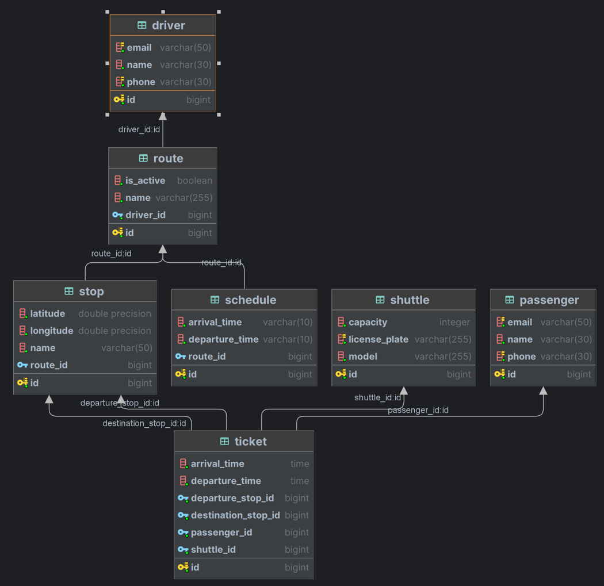

# BookingShuttle REST API

## Описание предметной области

Система для компании-перевозчиков, осуществляющих регулярные рейсы, и их клиентов.
- Клиент может:
  - просматривать/редактировать информацию о себе
  - просматривать информацию о доступных поездках 
  - бронировать поездки
  - просматривать список своих поездок (в том числе историю)
- Компания может:
  - просматривать/редактировать информацию о себе 
  - регистрировать автомобили, поездки, расписания, водителей
- Водитель может:
  - просматривать информацию о своих маршрутах
  - отмечать явку/неявку клиента
  
### Схема базы данных 

## Требования

- Java Development Kit (JDK) версии 17
- Docker (для запуска РСУБД PostgreSQL)
- папку (mvn/wrapper) добавить "." в названии
